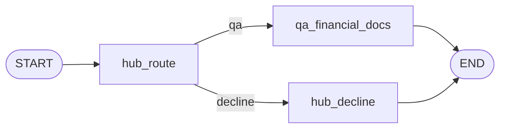

# Fincent

Fincent is a **framework-style** multi-agent financial assistant. It aims to answer general finance questions (with the Q&A Agent), questions about a specific portfolio (with the Portfolio Agent), offer answers and insights about stock market trends (with the Market Agent), and help with planning for financial goals (with the Goal Agent). 

## Architecture

```text
                              ┌────────────────────────────────┐
                              │          Frontend UI           │
                              │      (React / Streamlit)       │
                              └────────────────┬───────────────┘
                                               │
                              ┌────────────────▼───────────────┐
                              │      Orchestrator Agent        │
                              │      (Router + Planner)        │
                              └────────────────┬───────────────┘
        ┌──────────────────────┬────────────────┴────────────────┬──────────────────────┐
        ▼                      ▼                                 ▼                      ▼
 ┌──────────────┐       ┌──────────────┐                 ┌──────────────┐       ┌──────────────┐
 │   Q&A Agent  │       │  Portfolio   │                 │    Market    │       │     Goal     │
 │              │       │    Agent     │                 │    Agent     │       │   Planner    │
 └──────┬───────┘       └──────┬───────┘                 └──────┬───────┘       └──────┬───────┘
        │                      │                                │                      │
 ┌──────▼───────┐       ┌──────▼───────┐                 ┌──────▼───────┐       ┌──────▼───────┐
 │  RAG System  │       │  Portfolio   │                 │    Market    │       │   Planning   │
 │ (vector DB + │       │    store     │                 │  data APIs   │       │    layer     │
 │  embeddings) │       │ (holdings)   │                 │ (yFinance…)  │       │              │
 └──────────────┘       └──────────────┘                 └──────────────┘       └──────────────┘
```

## How it does it

- ** Orchestrator Agent (router / planner)** reads the conversation and classifies intent. It either:
  - routes to the **Q&A spoke** for **generic educational** questions about finance, markets, regulations, and financial documents (answered from **pretrained knowledge only**), or
  - **declines** requests that imply live market data, personal portfolio guidance, trading or security-specific advice, or individualized financial / tax / legal planning (when in doubt, it declines).
- **Financial documents Q&A agent** is the only spoke today: it uses **agentic RAG** over local docs in `data/`, chunked and indexed into a local **FAISS** vector store. Answers include source document citations.
- **Multi-turn memory** is the chat transcript stored in **Streamlit session state**; each turn invokes the graph with the full message list so context is preserved for the hub and the Q&A agent.



## Tech stack

| Piece | Role |
|--------|------|
| [LangGraph](https://github.com/langchain-ai/langgraph) | `StateGraph`: route → spoke or decline → end |
| [LangChain OpenAI](https://python.langchain.com/) | `ChatOpenAI`, structured output for routing |
| [Streamlit](https://streamlit.io/) | Sidebar (API key, model, clear chat), chat UI |
| OpenAI API | Default model `gpt-4o-mini` (configurable) |

## Project layout

| Path | Purpose |
|------|---------|
| `streamlit_app.py` | UI: session transcript, cached compiled graph, one turn per user message |
| `graph/workflow.py` | Builds and compiles the hub-and-spoke graph |
| `agents/hub/` | Routing (`planner`, `nodes`), decline copy (`decline`, `prompts`) |
| `agents/qa/` | Q&A spoke prompts, FAISS RAG ingestion/retrieval, and node factory |
| `state/` | `FincentState` (messages + route), UI ↔ LangChain message adapters |
| `config/` | `AppSettings`, env-backed defaults, `make_chat_model()` |
| `data/qa_seed_docs/` | Curated seed corpus (10 docs) for future vector DB ingestion |
| `data/vector_store/qa_faiss/` | Persisted FAISS index built from markdown docs under `data/` |
| `Dockerfile` | Container image for Hugging Face Spaces (Docker SDK) or local Docker |
| `.dockerignore` | Build-context exclusions (keeps images smaller; omits baked-in FAISS) |
| `requirements.txt` | Python dependencies |

## Install

Use Python 3.11+ (3.12 recommended). From this directory:

```bash
cd fincent
python -m venv .venv
source .venv/bin/activate   # Windows: .venv\Scripts\activate
python -m pip install -r requirements.txt
```

Dependencies include `streamlit`, `langgraph`, `langchain-openai`, `langchain-core`, and `pydantic`.

## Usage

1. Set your API key (either is fine):

   ```bash
   export OPENAI_API_KEY="your_key_here"
   ```

   Or paste the key in the app sidebar (stored only for that browser session).

2. Run the app **from the `fincent` directory** so package imports (`config`, `agents`, `graph`, `state`) resolve:

   ```bash
   cd fincent
   streamlit run streamlit_app.py
   ```

3. Open the local URL Streamlit prints (usually [http://localhost:8501](http://localhost:8501)).

4. Use **Clear conversation** in the sidebar to reset session memory.

### Optional environment variables

| Variable | Default | Meaning |
|----------|---------|---------|
| `OPENAI_MODEL` | `gpt-4o-mini` | Chat model for hub and Q&A spoke |
| `FINCENT_ROUTER_TEMPERATURE` | `0` | Sampling temperature for the router LLM |
| `FINCENT_QA_TEMPERATURE` | `0.2` | Sampling temperature for the Q&A spoke |
| `FINCENT_QA_DATA_DIR` | `./data` | Root folder scanned for markdown docs to ingest |
| `FINCENT_QA_INDEX_DIR` | `./data/vector_store/qa_faiss` | Folder where FAISS index is stored |
| `FINCENT_QA_CHUNK_SIZE` | `1800` | Chunk size for document ingestion |
| `FINCENT_QA_CHUNK_OVERLAP` | `250` | Overlap between adjacent chunks |
| `FINCENT_QA_TOP_K` | `4` | Number of retrieved chunks per query |
| `FINCENT_QA_EMBEDDING_MODEL` | `text-embedding-3-small` | Embedding model used for indexing/retrieval |

Example:

```bash
export OPENAI_API_KEY="sk-..."
export OPENAI_MODEL="gpt-4o-mini"
export FINCENT_QA_TEMPERATURE="0.2"
streamlit run streamlit_app.py
```

## Deploy on Hugging Face Spaces (Docker SDK)

Use this when you want a **containerized** Space. The `Dockerfile` in this repo runs **Streamlit** on `0.0.0.0` and honors the `PORT` environment variable (Spaces set this automatically).

### Repository layout

Hugging Face builds from the **repository root**. This app expects that root to match the **`fincent/`** folder (same files as here: `Dockerfile`, `streamlit_app.py`, `requirements.txt`, `data/`, etc.). If Fincent lives inside a monorepo, copy or publish **only** the `fincent` directory as the Space repo, or use a submodule dedicated to the Space.

### Steps

1. On [Hugging Face Spaces](https://huggingface.co/spaces), create a **new Space**.
2. Choose **Docker** as the SDK (not the default Streamlit template).
3. Push this project so the Space’s root contains `Dockerfile` and the rest of the app.
4. In the Space **Settings → Variables and secrets**, add at least:
   - `OPENAI_API_KEY` — required for chat, routing, and **embedding** when the FAISS index is first built.
5. Optional: set the same variables as in [Optional environment variables](#optional-environment-variables) (e.g. `OPENAI_MODEL`, `FINCENT_QA_*`).
6. Open the Space URL once the build finishes.

**FAISS index:** `.dockerignore` excludes `data/vector_store/` from the image so you do not ship a stale index. On first use (with a valid API key), the app **builds and saves** the index under `data/vector_store/qa_faiss` inside the container. Space filesystems are typically **ephemeral** unless you add persistent storage—after a restart, the index may rebuild (extra embedding API calls).

### Local Docker (sanity check)

From the `fincent` directory (same context the Space uses):

```bash
docker build -t fincent .
docker run --rm -p 7860:7860 \
  -e OPENAI_API_KEY="your_key_here" \
  fincent
```

Open [http://localhost:7860](http://localhost:7860).

## Streamlit Community Cloud (alternative)

You can also deploy with Streamlit’s hosted offering **without** Docker:

1. Point the app root at this **`fincent`** directory.
2. Set **Secrets** for `OPENAI_API_KEY` (and any `FINCENT_*` / `OPENAI_MODEL` overrides).
3. Main file: `streamlit_app.py`.

See [Streamlit Community Cloud documentation](https://docs.streamlit.io/streamlit-community-cloud) for the latest UI and `secrets.toml` format.

## Design notes

- **Hub-and-spoke orchestration** is implemented as explicit graph nodes and conditional edges in `graph/workflow.py`, not as ad-hoc `if` chains in the UI.
- **Typing**: shared state uses `FincentState` (extends LangGraph `MessagesState` with a `route` field); Pydantic models support structured routing decisions in `agents/hub/planner.py`.
- **Extending**: add a new folder under `agents/` for another spoke, register a node in `graph/workflow.py`, and extend the router schema/prompt in `agents/hub/` so the hub can branch to the new path.

## Limitations (by design)

- RAG is limited to **indexed markdown** under `data/`; no live web crawl or private filings unless you add them to the corpus (or the user pastes text in chat).
- No personalized investment, tax, or legal advice; out-of-scope topics receive a fixed-style decline from the hub path.
- Memory is **session-scoped** (Streamlit); persisting threads across sessions would require a checkpointer or external store (not included here).
